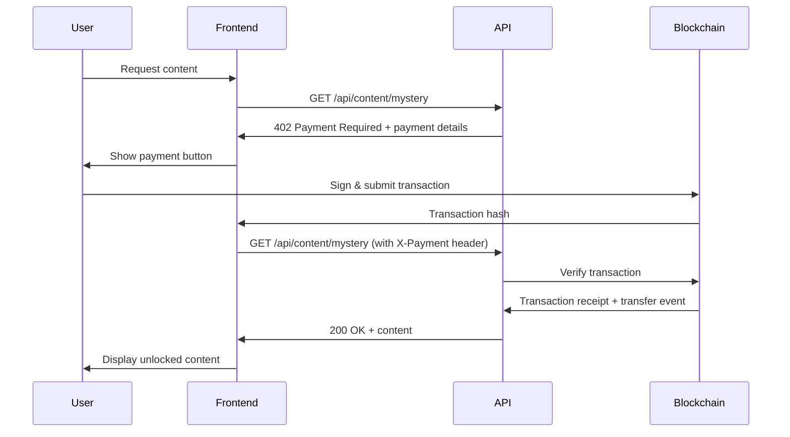

# x402 Payment Protocol on Avalanche

A Next.js implementation of the **HTTP 402 Payment Required** protocol using the Avalanche blockchain. This project demonstrates how to build a payment gateway that accepts ERC20 token payments on Avalanche Fuji testnet to unlock premium content.

## What is x402?

**x402** is an implementation of the HTTP 402 Payment Required status code (RFC 7231), which allows web servers to request payment before granting access to a resource. This project implements this standard using blockchain payments on Avalanche.

### How It Works

1. **Client requests protected content** → Server responds with `402 Payment Required`
2. **Server provides payment details** → Network, token address, amount, recipient
3. **Client initiates blockchain payment** → User signs transaction with their wallet
4. **Client sends payment proof** → Transaction hash in `X-Payment` header
5. **Server verifies payment on-chain** → Checks transaction receipt and transfer event
6. **Access granted** → Content is unlocked after successful verification

## Architecture

### Core Components

```
x402-avalanche/
├── app/
│   ├── api/content/[type]/route.ts    # API endpoint that enforces payment
│   ├── content/[type]/page.tsx        # Client-side payment flow
│   └── faucet/page.tsx                # Token faucet for testing
├── components/
│   ├── avalanche-payment-button.tsx   # Payment button component
│   └── connect-button.tsx             # Wallet connection UI
├── lib/
│   └── avalanche-payment.ts           # Core payment logic & verification
└── providers/
    └── reown-provider.tsx             # Wallet provider setup
```

### Payment Flow



## Features

- ✅ **HTTP 402 Payment Required** protocol implementation
- ✅ **Avalanche Fuji Testnet** integration
- ✅ **ERC20 token payments** with on-chain verification
- ✅ **Reown (WalletConnect) wallet** support
- ✅ **Automatic payment verification** via transaction receipts
- ✅ **Token faucet** for easy testing
- ✅ **Beautiful UI** with gradient designs and animations

## Getting Started

### Prerequisites

- Node.js 18+ and npm
- A Reown (WalletConnect) Project ID ([get one here](https://cloud.reown.com))
- Testnet AVAX for gas fees ([Core Faucet](https://core.app/tools/testnet-faucet/?subnet=c&token=c))

### Installation

1. **Clone and install dependencies:**

```bash
cd x402-avalanche
npm install
```

2. **Set up environment variables:**

Create a `.env.local` file:

```env
NEXT_PUBLIC_REOWN_PROJECT_ID=your_reown_project_id
NEXT_PUBLIC_RECEIVER_ADDRESS=0xYourWalletAddress
NEXT_PUBLIC_NETWORK=avalanche-fuji
```

3. **Run the development server:**

```bash
npm run dev
```

4. **Open your browser:**

Navigate to [http://localhost:3000](http://localhost:3000)

## Usage

### 1. Get Test Tokens

Before making payments, you'll need test tokens:

1. Visit the **Token Faucet** at `/faucet`
2. Connect your wallet (must be on Avalanche Fuji)
3. Claim 1,000 tokens (available every 24 hours)

### 2. Unlock Premium Content

1. Navigate to the **Mystery Box** from the home page
2. Connect your wallet (Avalanche Fuji testnet required)
3. Click **Pay 10 Tokens** to unlock
4. Sign the transaction in your wallet
5. Wait for verification (automatic)
6. Enjoy your unlocked Avalanche curiosity! 🎁

### 3. How Payment Verification Works

The system verifies payments by:

1. **Checking transaction receipt** - Ensures transaction was successful
2. **Finding transfer event** - Locates the ERC20 Transfer event in transaction logs
3. **Validating recipient** - Confirms tokens were sent to the correct address
4. **Verifying amount** - Ensures the correct amount was transferred

All verification happens on-chain using Viem and the Avalanche RPC.

## Technical Details

### Payment Verification

The `requirePayment()` function in `lib/avalanche-payment.ts`:

```typescript
// Returns 402 if no payment header
if (!paymentHeader) {
  return NextResponse.json({ error: 'Payment Required', payment: {...} }, { status: 402 })
}

// Verifies payment if header is present
const payment: PaymentProof = JSON.parse(paymentHeader)
const isValid = await verifyPayment(payment, requirement)
```

### On-Chain Verification

The `verifyPayment()` function:

1. Fetches transaction receipt from Avalanche
2. Finds the ERC20 Transfer event log
3. Decodes the event (from, to, amount)
4. Validates recipient matches requirement
5. Validates amount meets requirement

### Token Configuration

Currently configured for:
- **Token Address:** `0x81FeDE901c8415A412f3407f6cEDBCDDC89D888c`
- **Network:** Avalanche Fuji (Chain ID: 43113)
- **Decimals:** 18
- **Token Symbol:** Tokens

## API Reference

### `GET /api/content/[type]`

Protected content endpoint that requires payment.

**Request without payment:**
```http
GET /api/content/mystery
```

**Response (402 Payment Required):**
```json
{
  "error": "Payment Required",
  "payment": {
    "network": "avalanche-fuji",
    "chainId": 43113,
    "amount": "10",
    "amountWei": "10000000000000000000",
    "token": "0x81FeDE901c8415A412f3407f6cEDBCDDC89D888c",
    "tokenSymbol": "Tokens",
    "recipient": "0x...",
    "description": "Access to Mystery Box Unlocked!",
    "resource": "/api/content/mystery"
  }
}
```

**Request with payment proof:**
```http
GET /api/content/mystery
X-Payment: {"txHash":"0x...","network":"avalanche-fuji","amount":"10"}
```

**Response (200 OK):**
```json
{
  "success": true,
  "content": {
    "title": "Mystery Box Unlocked!",
    "curiosity": {
      "title": "Avalanche Speed Record",
      "message": "...",
      "image": "...",
      "fact": "🚀 Lightning Fast Performance"
    },
    "type": "mystery"
  }
}
```

## Project Structure

```
x402-avalanche/
├── app/
│   ├── api/
│   │   └── content/[type]/route.ts     # Payment-protected API route
│   ├── content/[type]/page.tsx        # Content unlock page
│   ├── faucet/page.tsx                # Token faucet page
│   ├── facilitator/[type]/page.tsx    # Gasless payment facilitator (optional)
│   ├── layout.tsx                     # Root layout with providers
│   └── page.tsx                       # Home page
├── components/
│   ├── avalanche-content.tsx          # Content display component
│   ├── avalanche-payment-button.tsx   # Payment button with wallet integration
│   ├── connect-button.tsx             # Wallet connection button
│   ├── network-display.tsx            # Network status display
│   └── token-faucet.tsx               # Token faucet component
├── lib/
│   └── avalanche-payment.ts           # Core payment verification logic
└── providers/
    └── reown-provider.tsx             # Reown/WalletConnect provider setup
```

## Technologies Used

- **Next.js 15** - React framework with App Router
- **Viem** - Ethereum library for blockchain interactions
- **Wagmi** - React hooks for Ethereum
- **Reown AppKit** - Wallet connection UI (formerly WalletConnect)
- **TypeScript** - Type safety
- **Tailwind CSS** - Styling

## Network Configuration

This project is configured for **Avalanche Fuji Testnet**:

- **Chain ID:** 43113
- **RPC URL:** `https://api.avax-test.network/ext/bc/C/rpc`
- **Explorer:** [Snowtrace Testnet](https://testnet.snowtrace.io)

## Security Considerations

- ✅ Payment verification happens on-chain (no trust required)
- ✅ Transaction receipts are checked for success status
- ✅ Transfer events are decoded and validated
- ✅ Recipient and amount are verified against requirements
- ⚠️ Currently configured for testnet - update addresses for mainnet

## Future Enhancements

- [ ] Support for multiple tokens (USDC, AVAX, etc.)
- [ ] Payment caching/session management
- [ ] Gasless payment facilitator integration
- [ ] Multi-chain support
- [ ] Payment history and receipts
- [ ] Subscription-based payments

## Contributing

Contributions are welcome! Please feel free to submit a Pull Request.

## License

This project is open source and available under the MIT License.

## Resources

- [Avalanche Documentation](https://docs.avax.network/)
- [Reown Documentation](https://docs.reown.com/)
- [Viem Documentation](https://viem.sh/)
- [HTTP 402 Status Code](https://developer.mozilla.org/en-US/docs/Web/HTTP/Status/402)

## Support

For issues, questions, or contributions, please open an issue on the repository.

---

**Built with 🔺 Avalanche** | **Powered by x402 Payment Protocol**

